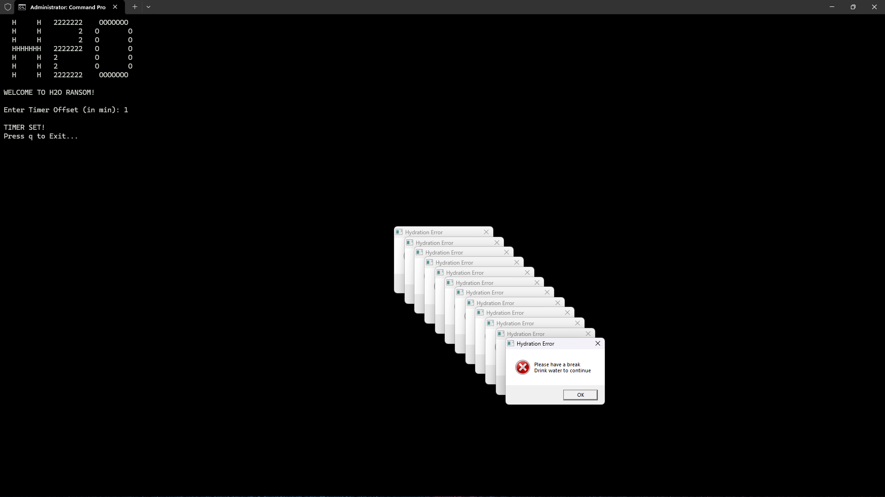

# **💧 geek-health-H2O-Ransom**
**An ethical, system-level hydration enforcer written in C (Windows).**  
Drink water 💦 or face controlled, OS-level consequences — for your own good.



## 🧠 What is this project?
`geek-health-H2O-Ransom` is a **Windows system utility** that reminds you to drink water by **behaving like a harmless, ethical parody of ransomware.**

Instead of stealing data, it steals your attention — until you hydrate.

This project is built purely for learning and personal health, combining:
- System programming in C
- Windows process & thread management
- Scheduling and timing mechanisms
- Clean shutdown & user control

## 🎯 Motivation
When deeply focused on a screen, it’s easy to forget basic things — like drinking water.

This project was created to:
- Enforce healthy hydration habits
- Explore real OS-level programming concepts
- Learn how malware-like behaviors actually work (ethically)

**⚠️ This is NOT malware.**  
It does not persist, steal data, modify the system, or hide itself.

## ⚙️ How it works (High Level)
1. User sets a **time interval** (in minutes)
2. A **background scheduler thread waits** for that interval
3. When time expires:
    - **Multiple error dialogs** are triggered (process-based)
    - User **attention is forced**
4. User can **exit cleanly anytime by pressing q**

Two scheduling strategies are implemented:
- **Polling / interval-splitting** (learning version)
- **Event-based scheduler** (professional version)

## 🧩 Key Features
- 🧵 Threaded scheduler
- 🧨 Process-based dialog spawning (ransomware-style UX)
- ⏱️ Configurable time interval
- 🛑 Instant, graceful exit
- 🧠 No busy-waiting, no forced kill
- 💻 Pure Win32 + C (no frameworks)

## 📁 Project Structure

```
geek-health-H2O-Ransom/
│
├── assets/
│   └── image.png              # Project image / banner
│
├── docs/                      # Documentation (future use)
│
├── src/
│   ├── hydrate.c              # Main entry point
│   ├── Scheduler.c            # Scheduling logic
│   ├── Scheduler.h
│   ├── WaterError.c           # Error dialog logic
│   ├── WaterError.h
│   ├── H2Obanner.c            # CLI banner
│   ├── H2Obanner.h
│   ├── thread_args.h          # Thread argument definitions
│   └── hydrate.exe            # (ignored in git)
│
├── scripts/                   # Build / helper scripts (future)
│
├── test/                      # Experiments & learning code
│
├── .gitignore
└── README.md
```

## 🚀 Build & Run
**Requirements**
- Windows
- GCC / MinGW (or MSVC)

**Compile (example)**  
1. **Enter the `src` directory**
    ```bash
    cd src
    ```
    
2. **Complile the Programs**

    ```bash
    gcc H2Obanner.c WaterError.c hydrate.c Scheduler.c -o hydrate
    ```

3. **Run**
    ```bash
    ./hydrate
    ```
    **or**
    ```bash
    hydrate.exe
    ```

## ⌨️ Controls
- Enter interval in minutes
- Program runs in background
- Press q anytime to exit cleanly

## 🧪 Learning Outcomes
**This project explores:**
- Win32 `MessageBox`, `CreateProcess`, `CreateThread`
- Blocking vs non-blocking behavior
- Thread lifecycle vs process lifecycle
- Scheduling trade-offs (polling vs events)
- Graceful shutdown design
- Why OS primitives exist

## ⚠️ Disclaimer
This project is:
- Educational
- Ethical
- Non-persistent
- User-controlled

It does not:
- Modify system settings
- Run on startup
- Hide itself
- Collect data

## 📜 License
**MIT License**  
Free to use, learn from, and modify.

## ❤️ Final Note
This project is less about hydration  
and more about understanding systems.

If it made you drink water and learn OS internals —  
**Mission Accomplished 💦🖤**